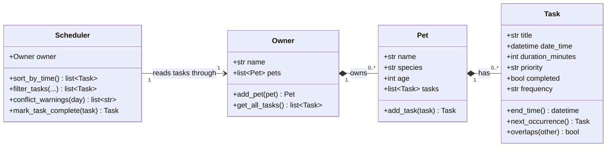

# 🐾 PawPal+

A pet care planning assistant for busy owners. PawPal+ tracks care tasks across
all of your pets, orders them by time or priority, warns you when two tasks
collide, and rolls repeating tasks forward on its own.

Built as a Streamlit app over a pure-Python logic layer, with 44 tests.

## The problem

A busy pet owner needs help staying consistent with pet care:

- Track care tasks — walks, feeding, meds, enrichment, grooming, vet visits
- Respect real constraints — how long each task takes, how urgent it is
- Produce a daily plan, and say when that plan does not actually fit

## ✨ Features

**Scheduling**

- **Chronological ordering** — `Scheduler.sort_by_time()` puts tasks in real
  time order across every pet and every day.
- **Priority ordering** — `Scheduler.get_sorted_tasks()` sorts high → medium →
  low, breaking ties by start time.
- **Day planning** — `Scheduler.get_daily_tasks(day)` gives one day's tasks in
  time order.

**Filtering**

- **By pet** — `Scheduler.filter_by_pet(name)`.
- **By completion status** — `Scheduler.filter_by_status(completed)`.
- **All at once** — `Scheduler.filter_tasks(pet_name, completed, day)`, where
  any filter left as `None` is ignored.

**Conflict warnings**

- **Overlapping durations, not just equal start times** — a 30-minute walk at
  08:00 is flagged against 08:15 medication, because every task carries a
  duration and therefore a real end time.
- **Across pets** — you cannot walk the dog and medicate the cat at once.
- **Warnings, never exceptions** — `Scheduler.conflict_warnings()` returns
  readable strings. PawPal+ tells you the day does not fit and leaves the fix
  to you.
- **Correct across midnight** — a 23:50 walk overlapping 00:10 meds is reported
  on the day the overlap happens.

**Recurring tasks**

- **Automatic on completion** — tick off a daily task and tomorrow's copy
  appears (`Scheduler.mark_task_complete()`).
- **Bulk expansion** — `Scheduler.create_recurring_tasks(until)` fills a date
  range ahead of time.
- **No duplicates** — both paths check before creating, so either is safe to
  run twice.
- **Correct date arithmetic** — `timedelta` handles month ends and leap days:
  Jan 31 + 1 day is Feb 1.

**Validation**

- Priority, frequency, and duration are checked in `Task.__post_init__`, so an
  invalid task cannot exist. The UI dropdowns are built from the same
  constants, so the two layers cannot drift apart.

## Getting started

### Setup

```bash
python -m venv .venv
source .venv/bin/activate  # Windows: .venv\Scripts\activate
pip install -r requirements.txt
```

### Run it

```bash
streamlit run app.py   # the full UI
python main.py         # terminal demo of the logic layer
python -m pytest       # the test suite
```

## 🧱 Project structure

| File | Role |
|------|------|
| `pawpal_system.py` | Logic layer — `Owner`, `Pet`, `Task`, `Scheduler`. No UI code. |
| `app.py` | Streamlit UI. Holds no scheduling logic; every button calls a method on the logic layer. |
| `main.py` | Terminal demo of the logic layer. |
| `tests/test_pawpal.py` | Pytest suite for the logic layer. |
| `conftest.py` | Puts the project root on `sys.path` so bare `pytest` works. |
| `diagrams/uml_final.mmd` | Final class diagram, verified against the code. |
| `diagrams/uml.mmd` | Same diagram under the original filename. |
| `reflection.md` | Design choices, tradeoffs, and AI collaboration notes. |

The UI keeps its `Owner` in `st.session_state`. Streamlit re-runs the whole
script on every interaction, so an `Owner` built as a plain local would be
rebuilt empty each time; storing it in session state keeps one object — and
every pet and task added to it — alive across re-runs.

### Architecture

The full class diagram lives in [`diagrams/uml_final.mmd`](diagrams/uml_final.mmd).
`Scheduler` keeps no task list of its own — it holds an `Owner` and reads
everything through `owner.get_all_tasks()`, so a task added with
`Pet.add_task()` is visible to the schedule immediately and the two can never
drift out of sync.



## 🖥️ Sample Output

Running the demo script exercises the whole logic layer in `pawpal_system.py`:

```bash
python main.py
```

```
PawPal+ scheduling demo

Jordan's pets
==============================================================
  Mochi (dog, 3)  -  4 tasks
  Biscuit (cat, 7)  -  3 tasks

Sorted by time — Scheduler.sort_by_time()
==============================================================
  [ ] Wed 08:00–08:30  Morning walk     Mochi     high    (daily)
  [ ] Wed 08:45–08:55  Breakfast        Mochi     high   
  [ ] Wed 08:45–08:55  Breakfast        Biscuit   high   
  [ ] Wed 09:00–09:05  Thyroid meds     Biscuit   high    (daily)
  [ ] Wed 14:00–14:20  Puzzle feeder    Mochi     low    
  [ ] Wed 18:30–19:00  Evening walk     Mochi     medium 
  [ ] Wed 19:00–19:15  Brushing         Biscuit   low     (weekly)

Sorted by priority — Scheduler.get_sorted_tasks()
==============================================================
  [ ] Wed 08:00–08:30  Morning walk     Mochi     high    (daily)
  [ ] Wed 08:45–08:55  Breakfast        Mochi     high   
  [ ] Wed 08:45–08:55  Breakfast        Biscuit   high   
  [ ] Wed 09:00–09:05  Thyroid meds     Biscuit   high    (daily)
  [ ] Wed 18:30–19:00  Evening walk     Mochi     medium 
  [ ] Wed 14:00–14:20  Puzzle feeder    Mochi     low    
  [ ] Wed 19:00–19:15  Brushing         Biscuit   low     (weekly)

Filtered to Biscuit — Scheduler.filter_by_pet('Biscuit')
==============================================================
  [ ] Wed 08:45–08:55  Breakfast        Biscuit   high   
  [ ] Wed 09:00–09:05  Thyroid meds     Biscuit   high    (daily)
  [ ] Wed 19:00–19:15  Brushing         Biscuit   low     (weekly)

Outstanding tasks — Scheduler.filter_by_status(completed=False)
==============================================================
  [ ] Wed 08:00–08:30  Morning walk     Mochi     high    (daily)
  [ ] Wed 08:45–08:55  Breakfast        Mochi     high   
  [ ] Wed 08:45–08:55  Breakfast        Biscuit   high   
  [ ] Wed 09:00–09:05  Thyroid meds     Biscuit   high    (daily)
  [ ] Wed 14:00–14:20  Puzzle feeder    Mochi     low    
  [ ] Wed 18:30–19:00  Evening walk     Mochi     medium 
  [ ] Wed 19:00–19:15  Brushing         Biscuit   low     (weekly)

Combined — Mochi's outstanding tasks today
==============================================================
  [ ] Wed 08:00–08:30  Morning walk     Mochi     high    (daily)
  [ ] Wed 08:45–08:55  Breakfast        Mochi     high   
  [ ] Wed 14:00–14:20  Puzzle feeder    Mochi     low    
  [ ] Wed 18:30–19:00  Evening walk     Mochi     medium 

Conflict check — Scheduler.conflict_warnings()
==============================================================
  ⚠️  Breakfast (Mochi) 08:45–08:55 overlaps Breakfast (Biscuit) 08:45–08:55

  1 conflict(s) found. Nothing crashed — these are warnings.

Completing a daily task — Scheduler.mark_task_complete()
==============================================================
  Before: 7 tasks total
  Completed: Morning walk on Wed 16 Sep
  Auto-created: Morning walk on Thu 17 Sep (completed=False)
  After:  8 tasks total

Tomorrow's schedule
==============================================================
  [ ] Thu 08:00–08:30  Morning walk     Mochi     high    (daily)
```

The demo deliberately adds tasks **out of chronological order** and gives Mochi
and Biscuit breakfast at the **same 08:45 slot**, so sorting and conflict
detection both have something real to do. Completing the daily morning walk
auto-creates tomorrow's copy — that's `mark_task_complete()`, not the bulk
expansion.

## 🧪 Testing PawPal+

```bash
# Run the full test suite:
python -m pytest

# Quieter output:
python -m pytest -q

# With coverage:
python -m pytest --cov
```

A plain `pytest` works too — the root `conftest.py` puts the project directory
on `sys.path`, so `pawpal_system` imports either way.

### What the tests cover

44 tests in `tests/test_pawpal.py`, grouped around five core behaviors. Each
has a happy path and the edge cases that actually break schedulers:

| Area | Happy path | Edge cases covered |
|------|-----------|--------------------|
| **Task state** | `mark_complete()` flips a task to done; `mark_incomplete()` undoes it; `end_time()` is start + duration | Zero and negative durations rejected; unknown priority and frequency rejected at construction |
| **Sorting** | `sort_by_time()` returns chronological order regardless of insertion order; `get_sorted_tasks()` orders high → medium → low | Tasks spanning **different days** sort correctly (23:00 today before 06:00 tomorrow — a `"HH:MM"` string sort would get this backwards); identical start times keep insertion order |
| **Filtering** | Filter by pet, by completion status, by day, and all three combined | Unknown pet name returns `[]` rather than raising; a pet with no tasks; `filter_tasks()` with no arguments returns everything; two pets sharing a name |
| **Conflicts** | Overlapping ranges are flagged across different pets; `conflict_warnings()` returns strings and never raises | **Identical start times**; back-to-back tasks correctly *not* flagged; completed tasks excluded; a single task alone; an overlap **crossing midnight** |
| **Recurrence** | Completing a daily task creates tomorrow's copy; weekly jumps 7 days | One-off tasks create nothing; no duplicate when the occurrence already exists; completing the follow-up chains to the day after; month ends (Jan 31 → Feb 1) and leap years (Feb 26 2028 → Mar 4); a task no pet owns |
| **Empty states** | — | An owner with no pets answers every query with `[]` instead of raising |

### A bug the edge cases caught

Testing an overlap that crosses midnight found a real defect. A 23:50 walk
running 30 minutes overlaps 00:10 medication, and the global
`detect_conflicts()` caught it — but the day-scoped `detect_conflicts(day)`
reported nothing for *either* day, because it only looked at tasks whose
**start** fell on that date. Since the Streamlit UI calls the day-scoped
version, a user would never have seen the warning.

The fix was `Scheduler.tasks_touching(day)`, which selects tasks overlapping the
day's window rather than starting inside it. The conflict is now reported on the
day the overlap actually happens.

### Sample test run

```
============================= test session starts ==============================
platform darwin -- Python 3.9.6, pytest-8.4.2, pluggy-1.6.0
rootdir: /Users/mikeyamo-arthur/Documents/ai110-module2show-pawpal-starter
plugins: anyio-4.11.0
collected 44 items

tests/test_pawpal.py ............................................        [100%]

============================== 44 passed in 0.11s ==============================
```

### Confidence level

**★★★★☆ (4 / 5)**

Four rather than five. What earns the four: every scheduling algorithm has both
a happy-path and an edge-case test, the suite runs clean on Python 3.9 and 3.11,
and it caught a real cross-midnight bug rather than just confirming what the
code already did. The Streamlit layer was also driven end to end through
Streamlit's own `AppTest` runtime.

What holds back the fifth star:

- **No timezone or DST handling.** Every `datetime` is naive. On a
  spring-forward night, "daily" adds 24 hours, not "same wall-clock time
  tomorrow."
- **`Pet.has_task()` dedupes on title plus start time only**, so two genuinely
  different tasks sharing both would be treated as one.
- **No test at realistic scale.** The suite uses a handful of tasks; the
  pairwise conflict scan is `O(n²)` in the worst case and has never been run
  against a year of recurring tasks.
- **`Owner`, `Pet`, and `Task` have no persistence.** Everything lives in
  `st.session_state`, so closing the browser tab loses the data. That is a
  design limit rather than a bug, but it is untested territory.

## 📐 Smarter Scheduling

### Sorting

| Method | Behavior |
|--------|----------|
| `Scheduler.sort_by_time(tasks=None)` | Chronological order, earliest start first. Defaults to every task; pass a list to sort a subset. Because `Task.date_time` is a real `datetime`, `sorted()` orders it directly — no `"HH:MM"` string parsing, and tasks on different days can't interleave the way text sorting would. |
| `Scheduler.get_sorted_tasks()` | Priority order (high → medium → low), ties broken by start time. Uses a tuple key, `(t.priority_rank(), t.date_time)`. |
| `Task.priority_rank()` | Turns `"high"`/`"medium"`/`"low"` into `0`/`1`/`2` so priority sorts by urgency instead of alphabetically (which would give high, low, medium). |

### Filtering

| Method | Behavior |
|--------|----------|
| `Scheduler.filter_by_pet(pet_name)` | That pet's tasks in time order. An unknown name returns `[]` rather than raising. |
| `Scheduler.filter_by_status(completed)` | `True` for finished tasks, `False` for outstanding ones. |
| `Scheduler.get_daily_tasks(day)` | Tasks *starting* on one date, in time order. |
| `Scheduler.tasks_touching(day)` | Tasks *overlapping* one date — includes a 23:50 task from the night before that is still running. Used by conflict detection so cross-midnight overlaps aren't missed. |
| `Scheduler.filter_tasks(pet_name=None, completed=None, day=None)` | Combines all three. Any filter left as `None` is ignored, so `filter_tasks()` returns everything. |

### Conflict detection

| Method | Behavior |
|--------|----------|
| `Scheduler.detect_conflicts(day=None)` | Returns pairs of unfinished tasks whose time *ranges* overlap — not just identical start times. Works across pets: the owner can't walk the dog and medicate the cat at once. |
| `Scheduler.conflict_warnings(day=None)` | The same findings as readable strings. **Never raises** — a day with no overlaps returns `[]`. |
| `Task.overlaps(other)` | `self.date_time < other.end_time() and other.date_time < self.end_time()`. Back-to-back tasks are deliberately not conflicts. |

Sorting by start time first lets the inner loop stop as soon as a task starts
after the current one ends — everything later starts later still, so it can't
overlap either.

### Recurring tasks

| Method | Behavior |
|--------|----------|
| `Task.next_occurrence()` | Returns the next copy of a repeating task (`None` if it doesn't repeat), advanced by `timedelta(days=1)` or `timedelta(days=7)`. `timedelta` handles month ends and leap days, so Jan 31 + 1 day is Feb 1. The original is left untouched. |
| `Scheduler.mark_task_complete(task)` | Marks a task done **and automatically queues its next occurrence** if it's daily or weekly. Returns the new task, or `None` when there's nothing to create. |
| `Scheduler.create_recurring_tasks(until)` | Bulk-expands every repeating task through a chosen end date. |
| `Task.is_recurring()` | `frequency != "none"`. |

Both recurrence paths check `Pet.has_task(title, date_time)` first, so completing
a task whose next occurrence already exists creates no duplicate, and re-running
the bulk expansion is safe.

### Supporting pieces

| Method | Behavior |
|--------|----------|
| `Task.end_time()` | Start plus `duration_minutes` — what makes overlap detection possible at all. |
| `Owner.get_all_tasks()`, `Scheduler.pet_for(task)` | The scheduler holds an `Owner` and reads tasks through its pets, so there's one source of truth. |

## 📸 Demo Walkthrough

### What the UI lets you do

| Area | Actions available |
|------|-------------------|
| **Owner** | Rename the owner. One `Owner` object lives in `st.session_state` for the whole session. |
| **Pets** | Add a pet (name, species, age). A table lists every pet with its task count. "Load demo data" fills two pets and five tasks so you can look around immediately. |
| **Tasks** | Add a task to a chosen pet: title, type, date, start time, duration, priority, and how often it repeats. The priority and repeat dropdowns are built from the logic layer's own `PRIORITIES` and `FREQUENCIES`, so the UI cannot submit a value `Task` would reject. |
| **Schedule** | Pick any date. Filter by pet and by completion status. Tick tasks off. Three metrics show tasks today, how many are done, and total minutes of care. |
| **Conflicts** | A banner above the schedule names every overlap on the day, and each clashing row is marked inline. |
| **Other views** | Three expanders: all tasks by priority, all tasks by time, and outstanding tasks only. |
| **Recurring** | Roll every daily and weekly task forward through a date you choose. Safe to run twice. |

### An example workflow

1. Run `streamlit run app.py` and open the local URL. The app starts empty, so
   click **Load demo data** to get Mochi (dog, 3) and Biscuit (cat, 7).
2. **Add a pet** — type "Pip", choose *rabbit*, age 2, click **Add pet**. This
   calls `Owner.add_pet()`, and the pet table redraws with three rows.
3. **Schedule a task** — pick *Pip*, title it "Evening hay", set 19:00 for 10
   minutes at *medium* priority, and choose **daily** under Repeats. This calls
   `Pet.add_task()`.
4. **View today's schedule** — the day view lists every task in time order, each
   with its window (`08:00–08:30`), duration, pet, type, and priority.
5. **Notice the conflict** — the demo data puts Mochi's breakfast at 08:45 and
   Biscuit's at 08:50, both 10 minutes. A warning banner names the overlap and
   both rows are flagged with ⚠️.
6. **Filter** — set *Show pet* to **Biscuit** and *Show tasks* to
   **Outstanding**. The list narrows to Biscuit's unfinished tasks via
   `Scheduler.filter_tasks()`.
7. **Tick off the morning walk** — because it repeats daily, a toast confirms
   the next one is scheduled for tomorrow. Change the date to tomorrow and it
   is there.

### Scheduler behaviors the demo shows

- **Sorting by time** — tasks are added out of chronological order and still
  display earliest-first (`Scheduler.sort_by_time()`).
- **Sorting by priority** — the "All tasks by priority" expander puts high
  before medium before low, ties broken by start time.
- **Filtering** — by pet, by completion status, and by day, combined in one
  call to `Scheduler.filter_tasks()`.
- **Conflict warnings** — overlapping *durations*, not just identical start
  times, reported across different pets. The scheduler warns and never
  reschedules on its own: only the owner knows whether two pets can eat at
  once.
- **Daily recurrence** — completing a repeating task queues its next
  occurrence automatically (`Scheduler.mark_task_complete()`), and bulk
  expansion through a chosen date is available separately.

### Sample CLI output

The same logic layer, driven from the terminal with `python main.py`:

```
PawPal+ scheduling demo

Jordan's pets
==============================================================
  Mochi (dog, 3)  -  4 tasks
  Biscuit (cat, 7)  -  3 tasks

Sorted by time — Scheduler.sort_by_time()
==============================================================
  [ ] Wed 08:00–08:30  Morning walk     Mochi     high    (daily)
  [ ] Wed 08:45–08:55  Breakfast        Mochi     high   
  [ ] Wed 08:45–08:55  Breakfast        Biscuit   high   
  [ ] Wed 09:00–09:05  Thyroid meds     Biscuit   high    (daily)
  [ ] Wed 14:00–14:20  Puzzle feeder    Mochi     low    
  [ ] Wed 18:30–19:00  Evening walk     Mochi     medium 
  [ ] Wed 19:00–19:15  Brushing         Biscuit   low     (weekly)

Sorted by priority — Scheduler.get_sorted_tasks()
==============================================================
  [ ] Wed 08:00–08:30  Morning walk     Mochi     high    (daily)
  [ ] Wed 08:45–08:55  Breakfast        Mochi     high   
  [ ] Wed 08:45–08:55  Breakfast        Biscuit   high   
  [ ] Wed 09:00–09:05  Thyroid meds     Biscuit   high    (daily)
  [ ] Wed 18:30–19:00  Evening walk     Mochi     medium 
  [ ] Wed 14:00–14:20  Puzzle feeder    Mochi     low    
  [ ] Wed 19:00–19:15  Brushing         Biscuit   low     (weekly)

Filtered to Biscuit — Scheduler.filter_by_pet('Biscuit')
==============================================================
  [ ] Wed 08:45–08:55  Breakfast        Biscuit   high   
  [ ] Wed 09:00–09:05  Thyroid meds     Biscuit   high    (daily)
  [ ] Wed 19:00–19:15  Brushing         Biscuit   low     (weekly)

Outstanding tasks — Scheduler.filter_by_status(completed=False)
==============================================================
  [ ] Wed 08:00–08:30  Morning walk     Mochi     high    (daily)
  [ ] Wed 08:45–08:55  Breakfast        Mochi     high   
  [ ] Wed 08:45–08:55  Breakfast        Biscuit   high   
  [ ] Wed 09:00–09:05  Thyroid meds     Biscuit   high    (daily)
  [ ] Wed 14:00–14:20  Puzzle feeder    Mochi     low    
  [ ] Wed 18:30–19:00  Evening walk     Mochi     medium 
  [ ] Wed 19:00–19:15  Brushing         Biscuit   low     (weekly)

Combined — Mochi's outstanding tasks today
==============================================================
  [ ] Wed 08:00–08:30  Morning walk     Mochi     high    (daily)
  [ ] Wed 08:45–08:55  Breakfast        Mochi     high   
  [ ] Wed 14:00–14:20  Puzzle feeder    Mochi     low    
  [ ] Wed 18:30–19:00  Evening walk     Mochi     medium 

Conflict check — Scheduler.conflict_warnings()
==============================================================
  ⚠️  Breakfast (Mochi) 08:45–08:55 overlaps Breakfast (Biscuit) 08:45–08:55

  1 conflict(s) found. Nothing crashed — these are warnings.

Completing a daily task — Scheduler.mark_task_complete()
==============================================================
  Before: 7 tasks total
  Completed: Morning walk on Wed 16 Sep
  Auto-created: Morning walk on Thu 17 Sep (completed=False)
  After:  8 tasks total

Tomorrow's schedule
==============================================================
  [ ] Thu 08:00–08:30  Morning walk     Mochi     high    (daily)
```

**Screenshot or video** *(optional)*: <!-- Insert a screenshot or link to a demo video here -->
